## Mermaid diagram test matrix

These fixtures cover the Mermaid diagram types supported by the current Mermaid documentation. The two flowcharts test vertical and horizontal layouts.

### Flowchart (vertical)

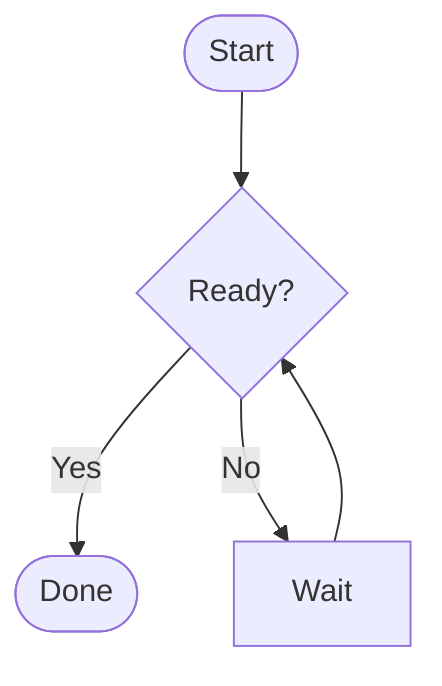

### Flowchart (horizontal)

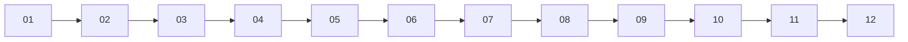

### Sequence diagram

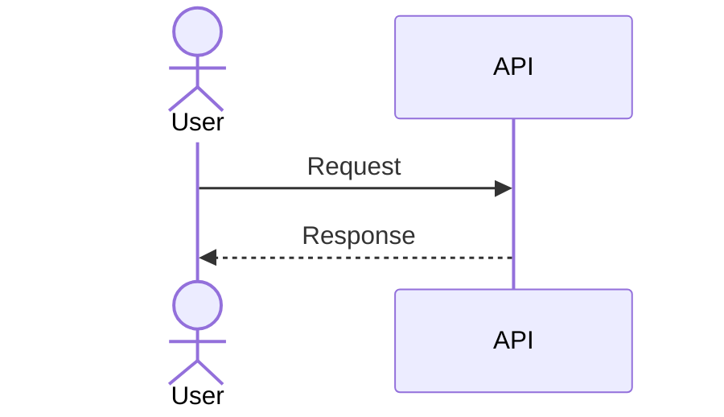

### Class diagram

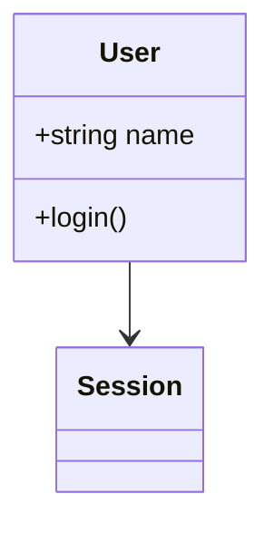

### State diagram

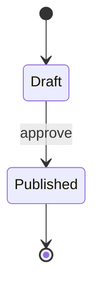

### Entity relationship diagram

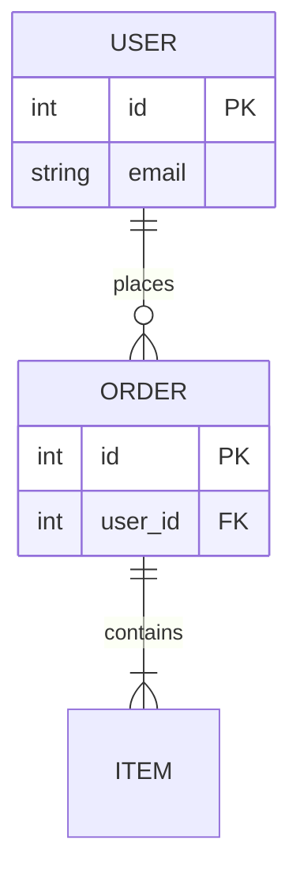

### User journey

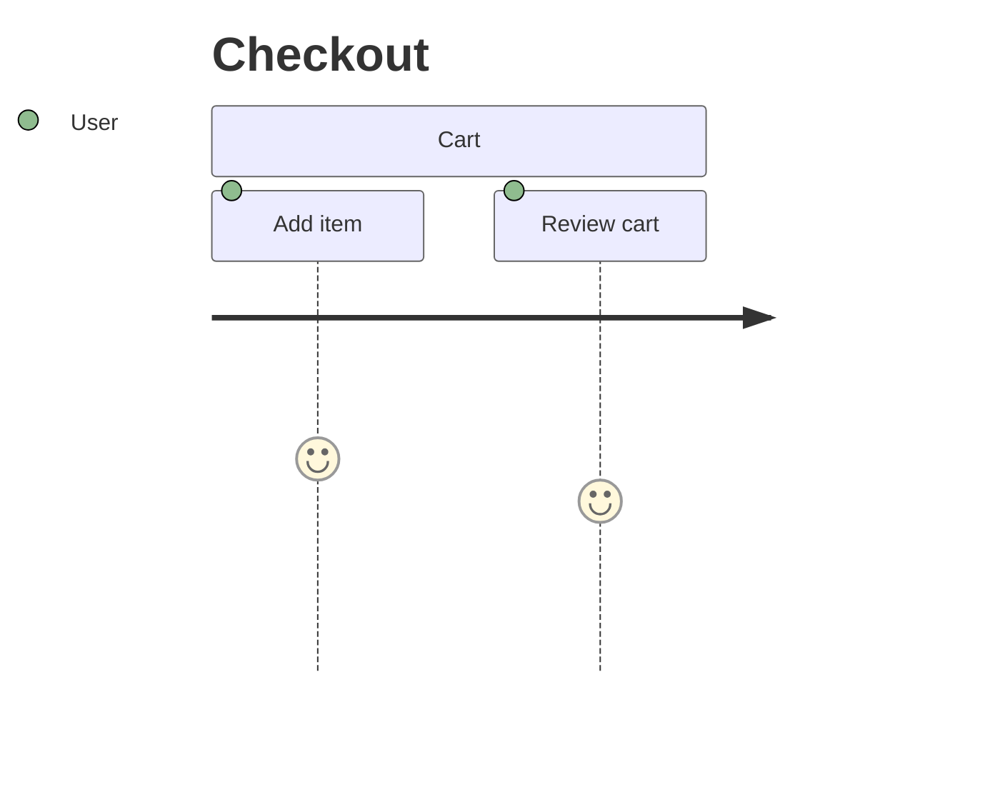

### Gantt chart

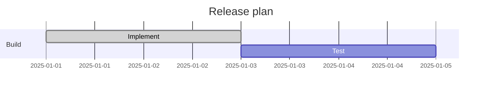

### Pie chart

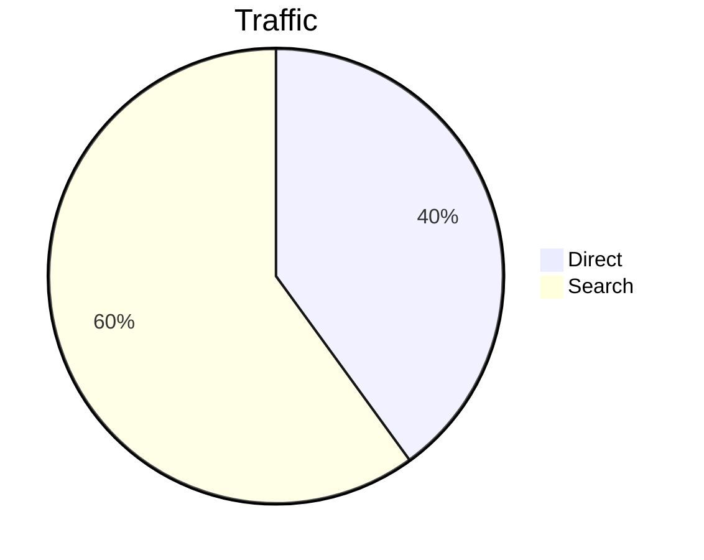

### Quadrant chart

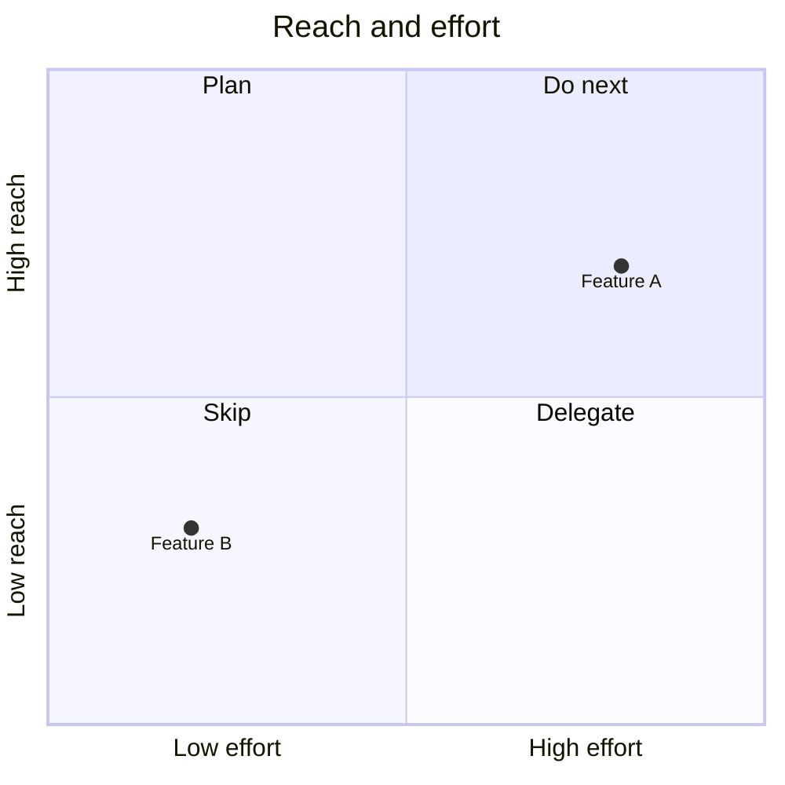

### Requirement diagram

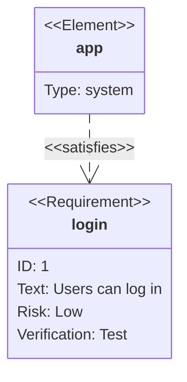

### Git graph

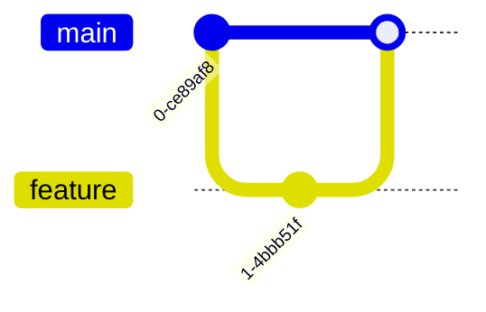

### C4 diagram

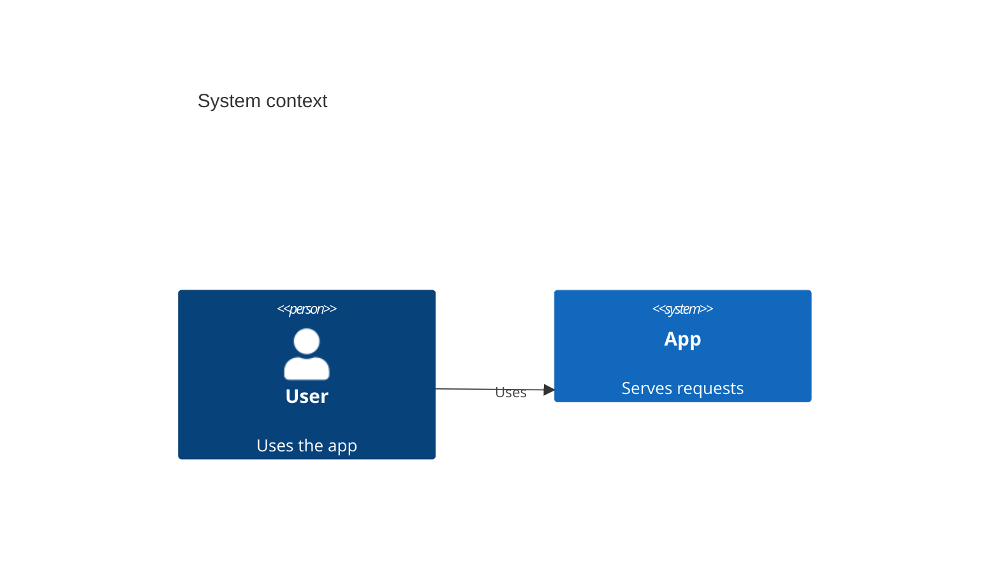

### Mindmap

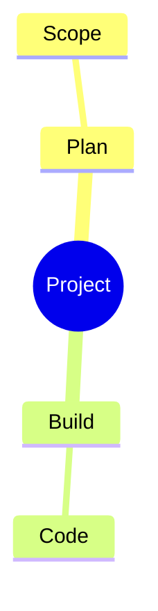

### Timeline

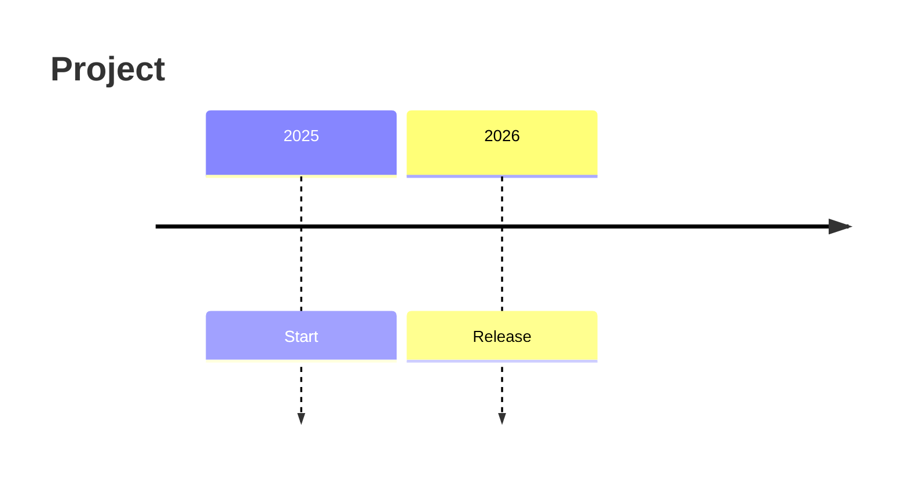

### ZenUML sequence diagram

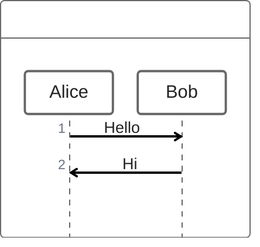

### Sankey diagram

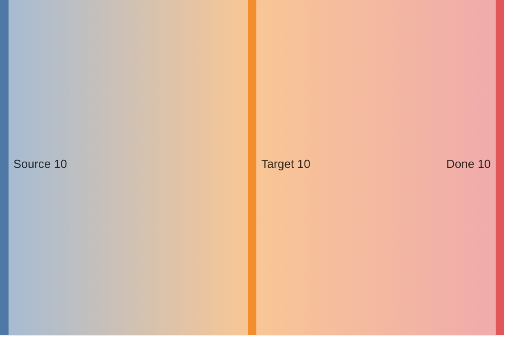

### XY chart

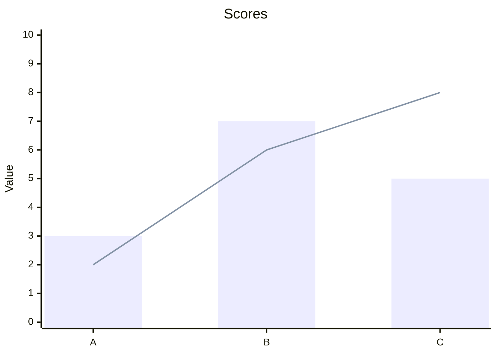

### Block diagram

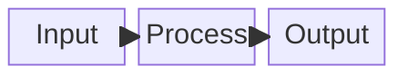

### Packet diagram

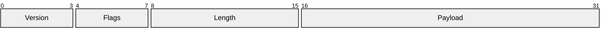

### Kanban diagram

```mermaid
kanban
  Backlog
    task1[Write docs]
  Done
    task2[Ship release]
```

### Architecture diagram

```mermaid
architecture-beta
  service internet(internet)[Internet]
  service server(server)[Server]
  internet:B --> T:server
```

### Radar chart

```mermaid
radar-beta
  title Team skills
  axis Speed, Quality, Docs, Ops
  curve Current { 4, 5, 3, 2 }
  max 5
```

### Treemap

```mermaid
treemap-beta
  "Product"
    "Core": 60
    "Docs": 40
  "Operations"
    "CI": 30
```
