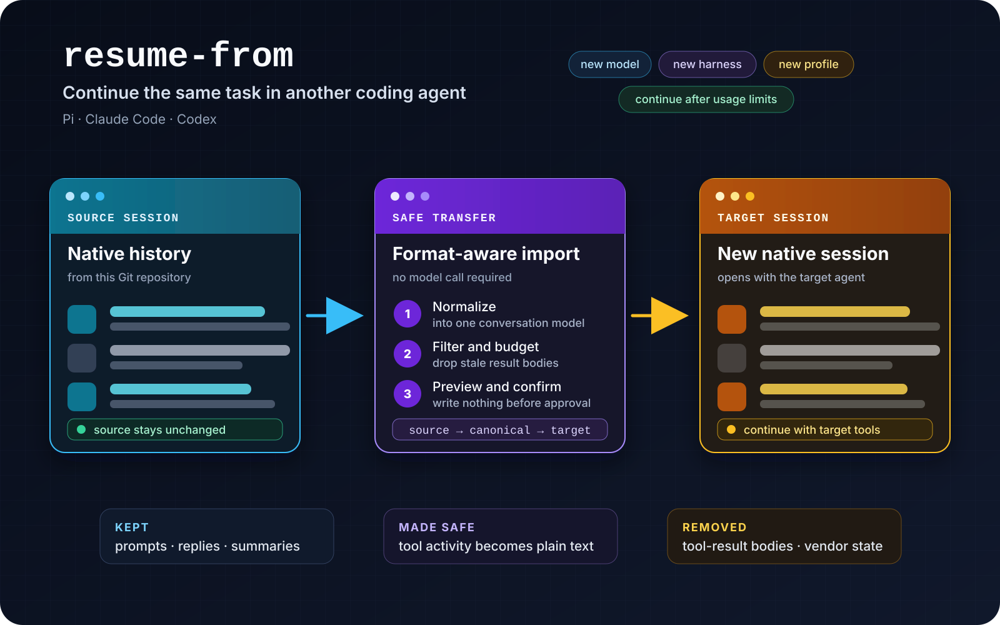

# @herbertgao/resume-from

HerbertGao-maintained fork of [`alexei-led/resume-from`](https://github.com/alexei-led/resume-from), preserving its MIT license and cross-agent session format. Local fixes are contributed upstream when possible.

[](https://github.com/alexei-led/resume-from/actions/workflows/release.yml)
[](https://www.npmjs.com/package/resume-from)



Continue an AI coding session in another terminal agent or another profile of the same agent.

`resume-from` converts saved sessions between **Pi**, **Claude Code**, and **Codex**. Use it when you want a different model, provider, tool harness, or account without rebuilding the task context by hand.

## Why this exists

Coding agents save conversations in different locations and vendor-specific formats. A Codex thread is not a Pi session. A Claude Code session cannot be opened directly by Codex.

You can ask the next agent to read another tool's raw session file, but then the model must understand that format and decide which internal data is safe or useful. `resume-from` performs that conversion before the target agent starts:

1. Find sessions for the current Git repository.
2. Parse the source agent's format into a common conversation model.
3. Remove tool-result bodies and vendor-only state.
4. Fit the useful history to the target context budget.
5. Show exactly what will be imported.
6. After confirmation, write a new session in the target agent's native format.

The source session is never changed.

## Use it when

- **You want another model or provider.** Start the target agent with the model you want, then import the session.
- **You want another harness.** Keep the task context while changing terminal UI, tools, permissions, extensions, or agent behavior.
- **You hit a rate or usage limit.** Continue through another installed agent or account instead of waiting or reconstructing the task.
- **You need another profile.** Move between work, personal, or team homes, including two profiles of the same agent.
- **The current context is too large.** Import a budgeted history into a fresh native session.
- **You want an independent handoff.** Create a target-side copy for continued work or review while preserving the original session.

`resume-from` moves conversation context. It does not copy the repository or migrate a running process. The target agent must have access to the same working tree.

## Supported transfers

Every source-to-target direction is supported, including transfers within the same agent:

| Source \ Target | Pi  | Claude Code | Codex |
| --------------- | :-: | :---------: | :---: |
| **Pi**          |  ✓  |      ✓      |   ✓   |
| **Claude Code** |  ✓  |      ✓      |   ✓   |
| **Codex**       |  ✓  |      ✓      |   ✓   |

The landing behavior depends on the target:

| Target          | After confirmation                                               |
| --------------- | ---------------------------------------------------------------- |
| **Pi**          | Writes and opens the imported session in the current Pi process. |
| **Claude Code** | Writes the session and prints `claude --resume <session-id>`.    |
| **Codex**       | Writes the thread and prints `codex resume <thread-id>`.         |

## What crosses the boundary

The importer keeps the parts needed to continue the task, subject to the target token budget:

- User prompts and agent replies.
- Compaction summaries.
- Tool activity as **non-replayable plain text**: tool name, recorded arguments, and a one-line outcome.
- Changed-file paths derived from mutating tool activity.
- Source provenance and a summary of anything dropped.

It excludes:

- Tool-result bodies, which may be large, stale, or sensitive.
- Replayable tool-call structures.
- Hidden reasoning, system prompts, environment blocks, API keys, telemetry, and vendor process state.

A dropped result is marked in the imported conversation. The target agent can reread the current file or rerun a command when it needs fresh state.

### Context budget

By default, the imported history may use up to 30% of the target context window. The first request, recent turns, summaries, and changed-file records are pinned. If older unpinned turns must be removed, the preview reports them. If the pinned content alone does not fit, the import stops before writing.

## Install in the destination agent

Install `resume-from` in the agent that will receive the new session.

### Pi

```sh
pi install npm:@herbertgao/resume-from
```

Restart Pi, then run `/resume-from`.

### Claude Code

```sh
claude plugin marketplace add alexei-led/resume-from
claude plugin install resume-from@alexei-led-resume-from
```

### Codex

```sh
codex plugin marketplace add alexei-led/resume-from
codex plugin add resume-from@alexei-led-resume-from
```

The Codex prompt runs the matching published `resume-from` package through `npx`. Its first use needs npm registry access.

## Run the first transfer

Run the command from the Git repository that owns the source session.

### In Pi

1. Run `/resume-from`.
2. Select a source session in the native picker.
3. Read the preview.
4. Confirm.

Pi opens the imported session with an empty prompt. You decide when to continue.

### In Claude Code or Codex

1. Run `/resume-from` to list matching sessions.
2. Run `/resume-from <row>` to preview one.
3. Run the token-bearing `/resume-from <row> --confirm <token>` command printed by the preview.
4. Run the native resume command printed by the tool.

You can also select an exact session ID or file path. Selection by path does not bypass the current-repository check.

## Safety properties

- **Read-only source:** source homes and session files are not modified.
- **Explicit write:** cancellation or a blocked preview writes nothing.
- **Add-only target:** the importer creates target files; it does not replace or delete existing sessions.
- **Native validation:** the new file is validated and read back before it is reported as openable.
- **No model call during transfer:** conversion, filtering, budgeting, and writing are deterministic local operations.
- **Visible provenance:** the imported session identifies its source and states what was dropped without putting that marker in model context. Pi renders it as a transcript entry; Claude Code uses its native metadata entry; Codex prints it in the CLI because no safe durable out-of-context entry is verified.

## Documentation

The user and maintainer documentation is organized in [`docs/`](docs/README.md).

## Development

Development requires Node 24 LTS and Bun.

```sh
bun install
bun run build
bun run test
bun run typecheck
bun run lint
```

Run the command help after a build:

```sh
node dist/bin.js --help
```

## License

MIT.
